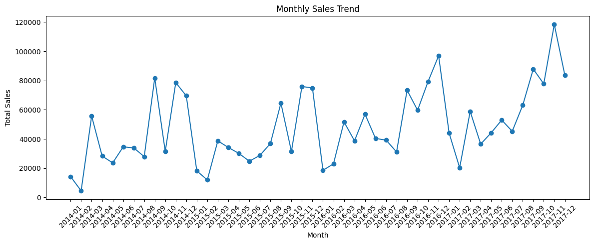
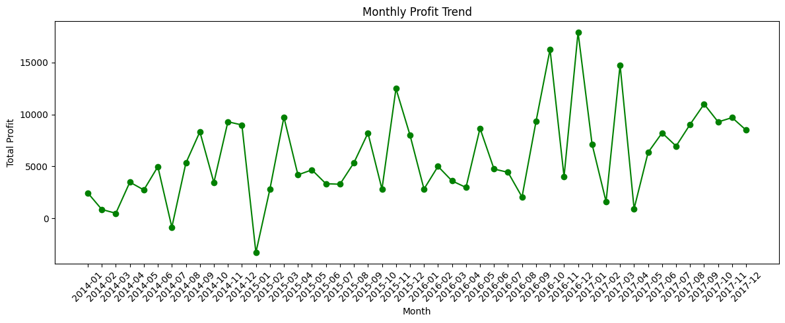
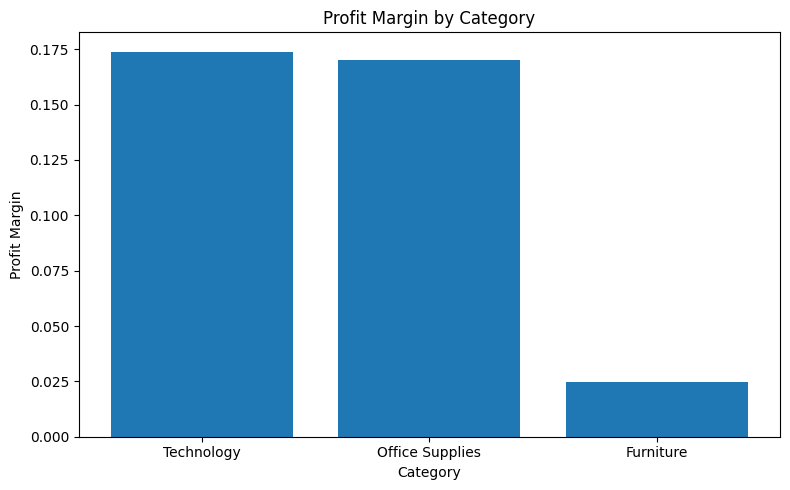
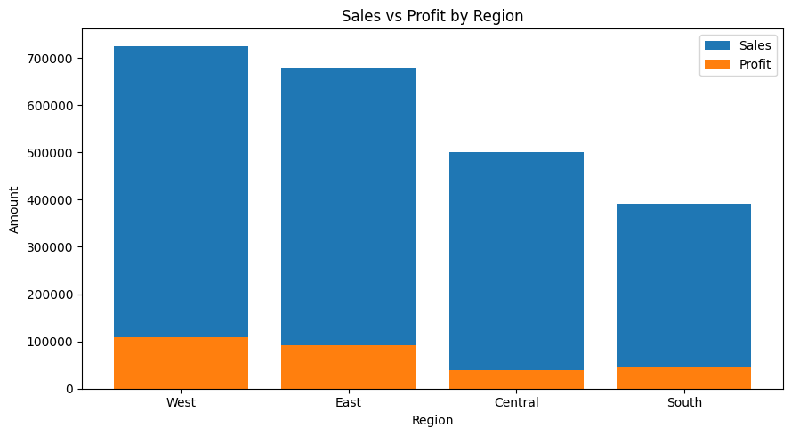
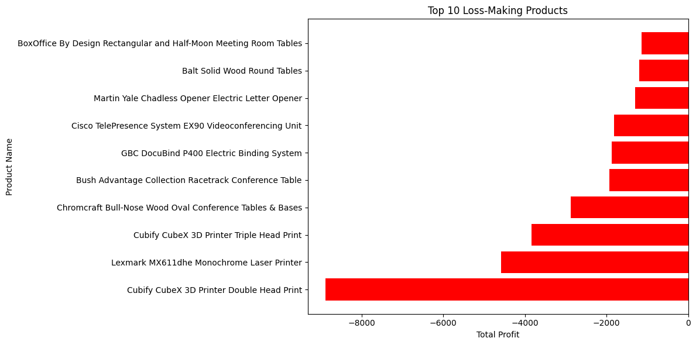

# 📊 Superstore Revenue & Profit Monitoring System


> An end-to-end automated business reporting pipeline that combines monthly sales files, validates data quality, calculates KPIs, detects profitability risks, and exports stakeholder-ready reports — all from a single notebook run.

[](https://nbviewer.org/github/ajaygande/superstore-revenue-profit-monitor/blob/main/Superstore_Revenue_Profit_Monitor.ipynb)

---

## 🔍 Business Problem

Sales teams typically receive transaction data in separate monthly files. Manually combining them, checking quality, calculating KPIs, and preparing reports is time-consuming and error-prone.

This project automates that entire workflow and produces consistent, reproducible monthly performance outputs — replacing hours of manual work with a single notebook execution.

---

## ⚙️ How It Works
Raw XLS File
│
▼
Data Preparation → Monthly File Split → Auto-Combine
│
▼
Data Validation (6 checks)
│
▼
KPI Calculation → Monthly Trend Analysis
│
▼
Risk Detection (5 alert types)
│
▼
Charts + CSV Reports + Business Insights

---

## 📁 Repository Structure
superstore-revenue-profit-monitor/
│
├── Superstore_Revenue_Profit_Monitor.ipynb   # Main notebook
├── sample_-_superstore.xls                   # Source dataset
├── requirements.txt                          # Dependencies
├── README.md                                 # This file
│
├── charts/                                   # Auto-generated on notebook run
│   ├── monthly_sales_trend.png
│   ├── monthly_profit_trend.png
│   ├── profit_margin_by_category.png
│   ├── sales_vs_profit_by_region.png
│   └── top_loss_making_products.png
│
└── output_reports/                           # Auto-generated on notebook run
├── kpi_summary.csv
├── monthly_kpi_summary.csv
├── data_validation_summary.csv
├── business_risk_alerts.csv
├── business_insights.txt
├── loss_making_products.csv
├── high_sales_low_profit_products.csv
├── high_discount_loss_products.csv
├── category_risk_summary.csv
├── region_risk_summary.csv
├── risky_months.csv
└── cleaned_combined_sales_data.csv

---

## 🚀 Setup & How to Run

**1. Clone the repository**
```bash
git clone https://github.com/ajaygande/superstore-revenue-profit-monitor.git
cd superstore-revenue-profit-monitor
```

**2. Install dependencies**
```bash
pip install -r requirements.txt
```

**3. Run the notebook**

Open `Superstore_Revenue_Profit_Monitor.ipynb` in Jupyter or VS Code and run all cells top to bottom. All charts and reports are generated automatically.

> ⚙️ All alert thresholds are in the **Configuration** cell at the top of the notebook. Edit them without touching any other code.

---

## 📊 Dataset

**[Superstore Dataset](https://www.kaggle.com/datasets/divyjain28/superstore-sales?select=sample_-_superstore.xls)** — a retail sales dataset containing transaction records across US regions, product categories, and customer segments.

| Field | Description |
|---|---|
| Order Date / Ship Date | Transaction and delivery dates |
| Region | US sales region |
| Category / Sub-Category | Product classification |
| Sales / Profit / Discount | Core financial fields |
| Quantity | Units sold per order line |

---

## ✅ Data Validation — 6 Checks

Before any KPI is calculated, the pipeline validates data reliability:

| Check | What It Catches |
|---|---|
| Missing required columns | Incomplete data extracts |
| Duplicate rows | Double-counted transactions |
| Negative sales values | Data entry errors |
| Zero / negative quantity | Invalid order records |
| Invalid discount values | Discounts outside 0–100% range |
| Ship date before order date | Impossible date sequences |

---

## 📈 Charts & Visualisations

### Monthly Sales Trend


### Monthly Profit Trend


### Profit Margin by Category


### Sales vs Profit by Region


### Top 10 Loss-Making Products


---

## 🚨 Risk Detection — 5 Alert Types

| Alert | Logic | Purpose |
|---|---|---|
| High Sales Low Profit | Top 25% sales + margin < 5% | Catch revenue that hides weak profitability |
| Loss-Making Products | Total profit < 0 | Flag items needing pricing or discount review |
| High Discount Loss | Avg discount ≥ 30% + negative profit | Identify where discounting destroys margin |
| Category Risk | Margin comparison across categories | Spot structurally weak product groups |
| Monthly Performance | >10% MoM drop in sales / profit / margin | Detect early warning signs in business trends |

---

## 📦 Key Outputs

| File | Description |
|---|---|
| `monthly_kpi_summary.csv` | Sales, profit, margin, growth % by month |
| `business_risk_alerts.csv` | Single combined exception report for stakeholders |
| `business_insights.txt` | Auto-generated plain-language performance summary |
| `data_validation_summary.csv` | Six-point data quality check results |
| `loss_making_products.csv` | All products with negative total profit |
| `cleaned_combined_sales_data.csv` | Final cleaned dataset after monthly files are merged |

---

## ❓ Business Questions Answered

- Which months had the highest and lowest sales and profit?
- Which products generated losses despite high sales volume?
- Is heavy discounting linked to negative profitability?
- Which categories and regions have structurally weak margins?
- Which months showed early warning signs of performance risk?

---

## 🛠️ Skills Demonstrated

- **Python & pandas** — data cleaning, aggregation, feature engineering, groupby operations
- **Automation** — monthly file simulation, auto-combine, single-run pipeline
- **Data Validation** — quality checks before any KPI is calculated
- **KPI Design** — profit margin, AOV, MoM growth rates, discount impact analysis
- **Business Thinking** — rule-based alerts that go beyond descriptive reporting
- **Data Visualisation** — matplotlib charts saved at print quality
- **Reporting** — CSV outputs and plain-language insight generation

---

## 📋 Requirements
pandas==2.2.2  
matplotlib==3.9.2  
xlrd==2.0.1  

---

*Dataset: Sample Superstore — a commonly used retail sales dataset for business analytics practice.*
